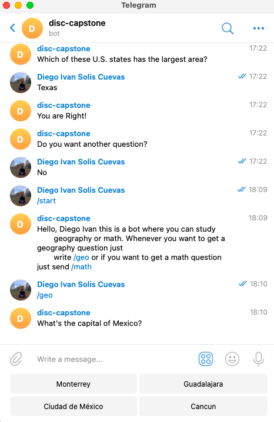

# Capstone Telegram Bot

> This is a Telegram bot that can help you study geography or math giving you questions of multiple choice

This is a microverse approach to develop a Telegram Bot in ruby.

## Built With

- Ruby

## Getting Started

### App description

The app will send you different multiple choice question of the selected subject and tells you if your
answer is correct or the correct answer and then asks you if you want another question. The choices will be
displayed in the keyboard

### Prerequisites

* Internet connection
* Having a Telegram Account

### Live DEMO

- go to this [link](https://t.me/disc3110_bot) and press the start button.

### Usage

you can use the /geo command to get a geography question or the /math command to get a math question

### Deployment

1. Create a Bot with [BotFather] https://t.me/BotFather
2. Copy the API TOKEN to your clipboard
3. Paste the token in the main file
4. Run bundle install
5. Run main
6. Open the Telegram app
7. Open your Bot conversation
8. Press the start button or send /start

👤 **Author**

- GitHub: [disc3110](https://github.com/disc3110)
- Twitter: [Diego Ivan Solis](https://twitter.com/disc3110)

## 🤝 Contributing

Contributions, issues, and feature requests are welcome!

Feel free to check the [issues page](https://github.com/disc3110/Capstone-Telegram-Bot/issues).

## Show your support

Give a ⭐️ if you like this project!

## Acknowledgments

- To developers, Microverse, ruby official guidelines and The odin Project

## 📝 License

This project is [MIT](https://es.wikipedia.org/wiki/Licencia_MIT) licensed.
